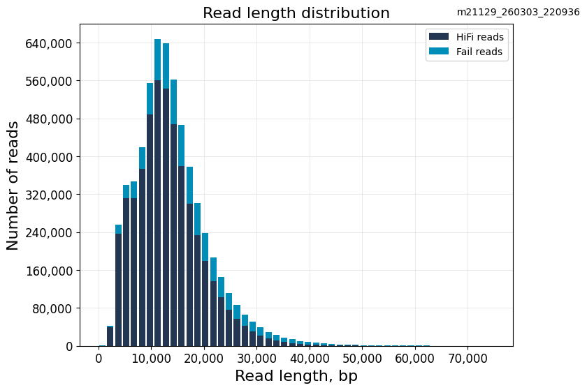
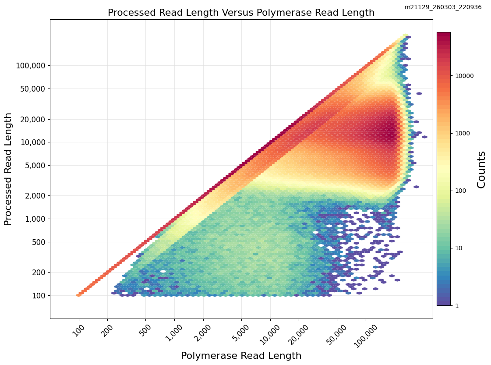

# Assembly Results — *Carya aquatica* (Water Hickory)

[← Back to Project Overview](../README.md)

---

## Assembly Workflow
1. Convert HiFi BAM to FASTQ
2. Raw read quality assessment (seqkit stats)
3. Adapter filtering (HiFiAdapterFilt)
4. Contamination screening (Centrifuge)
5. Post-QC read assessment
6. Genome size estimation (Jellyfish + GenomeScope2)
7. *De novo* assembly (hifiasm)
8. Assembly evaluation (QUAST, BUSCO, seqkit, etc.)

---

## Raw Reads

**Platform:** PacBio Vega  
**Flow Cell Type:** SMRTcell  
**Run ID:** r21129_20260303_220348  
**Instrument Software:** 1.1.0.47.44

### Summary Metrics

| Metric | Value |
|--------|-------|
| HiFi Reads | 4.9 M |
| HiFi Reads Yield | 64.85 Gb |
| HiFi Read Length (mean) | 13.12 kb |
| HiFi Read Length (median) | 12,372 bp |
| HiFi Read Length N50 | 14,980 bp |
| HiFi Read Quality (median) | Q37 |
| Base Quality ≥Q30 | 94.40% |
| HiFi Number of Passes (mean) | 12 |
| Missing Adapters | 2.08% |

### HiFi Read QC (seqkit stats)

| File | Format | Type | Num Seqs | Sum Len | Min Len | Avg Len | Max Len | Q1 | Q2 | Q3 | N50 | Q20 (%) | Q30 (%) | GC (%) |
|------|--------|------|----------|---------|---------|---------|---------|-----|-------|-------|-------|---------|---------|--------|
| carya_aquatica_hifi.fastq.gz | FASTQ | DNA | 4,935,257 | 64,756,226,301 | 106 | 13,121.1 | 64,392 | 8,839 | 12,372 | 16,457 | 14,979 | 97.74 | 94.41 | 36.2 |

### Read Length Distributions

<p align="center">
  
  &nbsp;
  
</p>
<p align="center">
  <em>Left: HiFi combined read length distribution. Right: Processed reads vs. polymerase read length.</em>
</p>

### Code: BAM to FASTQ Conversion

The raw HiFi reads were delivered as a PacBio BAM file. We converted to FASTQ using `samtools`:

```bash
samtools fastq \
    -@ ${THREADS} \
    ${INBAM} | gzip > ${OUTDIR}/${PREFIX}.fastq.gz
```

Full script: [01_raw_reads/01_bam_to_fastq.sh](01_raw_reads/01_bam_to_fastq.sh)

---

## Quality Control

*Coming soon — adapter filtering (HiFiAdapterFilt) and contamination screening (Centrifuge)*

---

## Genome Size Estimation

*Coming soon — Jellyfish k-mer counting + GenomeScope2*

---

## Assembly

*Coming soon — hifiasm de novo assembly*

---

## Assembly Evaluation

*Coming soon — QUAST, BUSCO, seqkit stats*
