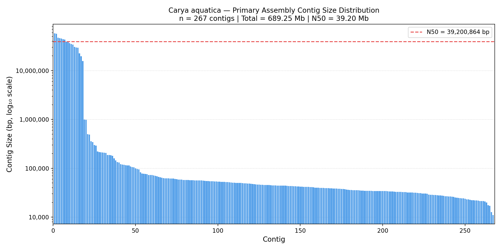

# Assembly Results — *Carya aquatica* (Water Hickory)

[← Back to Project Overview](../README.md)

---

## Assembly Workflow
1. Convert HiFi BAM to FASTQ
2. Raw read quality assessment (seqkit stats)
3. Contamination screening (Centrifuge)
4. Post-QC read assessment
5. Genome size estimation (Jellyfish + GenomeScope2)
6. *De novo* assembly (hifiasm)
7. Haplotig purging (purge_dups)
8. Scaffolding
9. Assembly evaluation (QUAST, BUSCO, seqkit, etc.)

> **Note:** Adapter filtering (HiFiAdapterFilt) was omitted because the PacBio Vega
> instrument removes adapters before outputting CCS/HiFi reads.

---

## Raw Reads

**Platform:** PacBio Vega  
**Flow Cell Type:** SMRTcell  
**Run ID:** r21129_20260303_220348  
**Instrument Software:** 1.1.0.47.44

### Summary Metrics

| Metric | Value |
|--------|-------|
| HiFi Reads | 4.9 M |
| HiFi Reads Yield | 64.85 Gb |
| HiFi Read Length (mean) | 13.12 kb |
| HiFi Read Length (median) | 12,372 bp |
| HiFi Read Length N50 | 14,980 bp |
| HiFi Read Quality (median) | Q37 |
| Base Quality ≥Q30 | 94.40% |
| HiFi Number of Passes (mean) | 12 |
| Missing Adapters | 2.08% |

### HiFi Read QC (seqkit stats)

| File | Format | Type | Num Seqs | Sum Len | Min Len | Avg Len | Max Len | Q1 | Q2 | Q3 | N50 | Q20 (%) | Q30 (%) | GC (%) |
|------|--------|------|----------|---------|---------|---------|---------|-----|-------|-------|-------|---------|---------|--------|
| carya_aquatica_hifi.fastq.gz | FASTQ | DNA | 4,935,257 | 64,756,226,301 | 106 | 13,121.1 | 64,392 | 8,839 | 12,372 | 16,457 | 14,979 | 97.74 | 94.41 | 36.2 |

### Read Length Distributions

<p align="center">
  
  &nbsp;
  
</p>
<p align="center">
  <em>Left: HiFi combined read length distribution. Right: Processed reads vs. polymerase read length.</em>
</p>

### Code: BAM to FASTQ Conversion

The raw HiFi reads were delivered as a PacBio BAM file. We converted to FASTQ using `samtools`:

```bash
samtools fastq \
    -@ ${THREADS} \
    ${INBAM} | gzip > ${OUTDIR}/${PREFIX}.fastq.gz
```

Full script: [01_raw_reads/01_bam_to_fastq.sh](01_raw_reads/01_bam_to_fastq.sh)

---

## Quality Control

### Contamination Screening (Centrifuge)

Reads were classified against the Centrifuge `hpvf` database to identify and remove non-plant contaminants.

| Metric | Value |
|--------|-------|
| Total reads | 4,935,257 |
| Clean reads | 4,124,583 |
| Contaminated reads | 810,674 (16.42%) |

#### Top 10 Contaminant Species

| Species | Tax ID | Rank | Genome Size | Num Reads | Unique Reads | Abundance |
|---------|--------|------|-------------|-----------|--------------|-----------|
| *Homo sapiens* | 9606 | species | 3,117,275,501 | 752,230 | 277,467 | 1 |
| *Colletotrichum destructivum* | 34406 | species | 51,785,203 | 106,937 | 28,208 | 0 |
| *Remersonia thermophila* | 72144 | species | 27,414,229 | 74,614 | 16,575 | 0 |
| *Ascochyta rabiei* | 5454 | species | 40,901,820 | 52,910 | 11,378 | 0 |
| *Thermothelomyces thermophilus* ATCC 42464 | 573729 | strain | 38,744,216 | 49,647 | 11,569 | 0 |
| *Rhizoctonia solani* | 456999 | species | 40,703,773 | 37,318 | 31,989 | 0 |
| *Botrytis cinerea* B05.10 | 332648 | strain | 42,630,066 | 36,100 | 9,406 | 0 |
| *Puccinia triticina* | 208348 | species | 122,823,596 | 35,911 | 13,712 | 0 |
| *Purpureocillium takamizusanense* | 2060973 | species | 35,574,015 | 33,068 | 7,304 | 0 |
| *Pichia kudriavzevii* | 4909 | species | 10,812,555 | 22,351 | 745 | 0 |

Full script: [02_quality_control/01_centrifuge.sh](02_quality_control/01_centrifuge.sh)

---

## Genome Size Estimation

*Coming soon — Jellyfish k-mer counting + GenomeScope2*

---

## Assembly

*Coming soon — hifiasm de novo assembly*

---

## Assembly Evaluation

Two assemblies were evaluated: one from unfiltered Vega reads (`reads_from_vega`) and one
from Centrifuge-cleaned reads (`hifiasm_centrifuge_reads`). Each assembly includes a primary
contig set and two haplotype-resolved sets (hap1, hap2).

Tools used:
- **seqkit stats** — basic sequence statistics
- **QUAST** — assembly quality metrics
- **BUSCO v5.7.1** — gene completeness (embryophyta_odb10)

### Summary Table

Assemblies were made from the sequences without cleaning with centrifuge (first set), and from reads cleaned of contaminants with centrifuge. The results indciate a substantially more fragmented assembly from the centrifuge cleaned reads. A potential solution is to go back to centrifuge and use a contaminant database that does not include humans.

<!-- Generated by 05_assembly_summary.py — re-run to update -->
| Metric | primary | hap1 | hap2 | centrifuge::primary | centrifuge::hap1 | centrifuge::hap2 |
| :--- | ---: | ---: | ---: | ---: | ---: | ---: |
| Num Sequences | 267 | 293 | 92 | 2,943 | 4,830 | 4,124 |
| Total Length | 689,247,006 | 688,655,421 | 666,170,333 | 727,511,574 | 676,878,358 | 638,424,009 |
| Min Length | 11,063 | 12,702 | 20,227 | 5,225 | 5,225 | 4,914 |
| Avg Length | 2,581,449.5 | 2,350,359.8 | 7,240,981.9 | 247,200.7 | 140,140.4 | 154,807 |
| Max Length | 58,087,373 | 58,087,373 | 43,532,277 | 3,200,719 | 2,948,787 | 3,311,791 |
| N50 (seqkit) | 39,200,864 | 39,200,864 | 30,684,502 | 436,350 | 224,044 | 231,258 |
| Contigs | 267 | 293 | 92 | 2943 | 4830 | 4124 |
| Largest Contig | 58087373 | 58087373 | 43532277 | 3200719 | 2948787 | 3311791 |
| Total Length (QUAST) | 689247006 | 688655421 | 666170333 | 727511574 | 676878358 | 638424009 |
| GC (%) | 36.37 | 36.35 | 36.29 | 36.08 | 36.09 | 36.10 |
| BUSCO Complete (%) | 98.7 | 98.7 | 98.7 | 96.9 | 93.9 | 92.9 |
| BUSCO Single-copy (%) | 91.0 | 91.0 | 91.6 | 86.2 | 85.3 | 85.0 |
| BUSCO Duplicated (%) | 7.7 | 7.7 | 7.1 | 10.7 | 8.6 | 7.9 |
| BUSCO Fragmented (%) | 0.9 | 0.9 | 1.1 | 2.1 | 3.5 | 3.8 |
| BUSCO Missing (%) | 0.4 | 0.4 | 0.2 | 1.0 | 2.6 | 3.3 |
| BUSCO Erroneous (%) | 3.3 | 3.4 | 3.0 | 3.3 | 3.1 | 2.9 |

Full script: [04_assembly/hifiasm/05_assembly_summary.py](04_assembly/hifiasm/05_assembly_summary.py)

### Contig Size Distribution — Unfiltered Reads (hifiasm, no Centrifuge)

The figure below shows the contig size distribution of the primary assembly produced by hifiasm
from unfiltered Vega HiFi reads. Centrifuge contamination filtering was not applied to these reads. Contigs are
ranked largest to smallest on the x-axis. The dashed red line marks the N50 (39.2 Mb).

<p align="center">
  
</p>
<p align="center">
  <em>Contig size distribution (log₁₀ y-axis) of the <em>Carya aquatica</em> primary assembly
  (hifiasm, unfiltered reads). n = 267 contigs | Total = 689.25 Mb | N50 = 39.20 Mb.</em>
</p>

Full script: [04_assembly/hifiasm/06_scaffold_size.sh](04_assembly/hifiasm/06_scaffold_size.sh) |
Python: [04_assembly/hifiasm/scaffold_histogram.py](04_assembly/hifiasm/scaffold_histogram.py)

---

## Haplotig Purging (purge_dups)

### Rationale

The hifiasm primary assembly (`p_ctg`) contains 267 contigs for a genome expected to span
16 chromosomes. With 7.7% BUSCO duplicated genes, a portion of the primary assembly consists
of haplotigs — redundant sequences representing one haplotype that were not fully separated
into the `hap1`/`hap2` outputs. These inflate contig count and total assembly size.

We used **purge_dups v1.2.6** (Guan et al. 2020) to identify and remove haplotigs based on
read coverage. No Hi-C or reference genome is required — the approach relies on the principle
that haplotigs are covered by only half the reads relative to true primary contigs.

### Approach

The workflow runs in three sequential SLURM jobs:

#### Step 1 — Align HiFi reads to the primary assembly (`minimap2`, `map-hifi` preset)

HiFi reads are mapped back to the primary assembly using `minimap2`. The `-x map-hifi` preset
is tuned for PacBio HiFi read characteristics. Output is a compressed PAF file recording
where each read aligns and at what depth.

```bash
minimap2 \
    -xmap-hifi \
    -t 32 \
    carya_aquatica.bp.p_ctg.fa.gz \
    carya_aquatica_hifi.fastq.gz \
    | gzip -c > reads_to_assembly.paf.gz
```

Full script: [05_purge_haplotigs/01_align_reads.sh](05_purge_haplotigs/01_align_reads.sh)

---

#### Step 2 — Coverage statistics, cutoff calling, and self-alignment

Four sub-steps run in sequence:

1. **`pbcstat`** — computes per-base coverage (`PB.base.cov`) and a per-read coverage
   histogram (`PB.stat`) from the PAF alignment
2. **`calcuts`** — automatically fits the coverage histogram to determine low, mid, and
   high thresholds that separate haplotigs (~½× coverage) from primary contigs (~1× coverage)
3. **`split_fa`** — splits the primary assembly at `N`-gap runs so that self-alignment does
   not span gap boundaries
4. **`minimap2` (`-x asm5 -DP`)** — all-vs-all self-alignment of the split assembly to
   detect overlapping duplicate sequences between contigs

```bash
pbcstat reads_to_assembly.paf.gz          # → PB.base.cov, PB.stat
calcuts PB.stat > cutoffs                 # → low/mid/high coverage thresholds
split_fa assembly.fa > assembly.split.fa  # → gap-split assembly
minimap2 -xasm5 -DP assembly.split.fa assembly.split.fa \
    | gzip -c > assembly.split.self.paf.gz
```

> **Note:** Review the `cutoffs` file before proceeding to step 3. If the histogram is
> bimodal (haplotig peak visible at ~½ coverage), `calcuts` thresholds are reliable.
> If the peak is unclear, cutoffs can be set manually with `-l/-m/-u` flags.

Full script: [05_purge_haplotigs/02_coverage_cutoffs.sh](05_purge_haplotigs/02_coverage_cutoffs.sh)

---

#### Step 3 — Purge and extract sequences

1. **`purge_dups`** — classifies contigs and contig regions using the coverage thresholds
   and self-alignment, writing a BED file of duplicated regions (`dups.bed`). The `-2` flag
   enables aggressive purging of partially duplicated contigs in addition to full haplotigs.
2. **`get_seqs`** — extracts two output FASTAs: `purged.fa` (cleaned primary assembly) and
   `hap.fa` (purged haplotigs)
3. **`seqkit stats`** — outputs basic QC metrics for both assemblies to the job log for
   immediate comparison against the pre-purge assembly

```bash
purge_dups -2 -T cutoffs -c PB.base.cov \
    assembly.split.self.paf.gz > dups.bed

get_seqs -e dups.bed carya_aquatica.bp.p_ctg.fa.gz
# → purged.fa  hap.fa

seqkit stats -a purged.fa
seqkit stats -a hap.fa
```

Full script: [05_purge_haplotigs/03_purge.sh](05_purge_haplotigs/03_purge.sh)

### Submitting the pipeline

Jobs are submitted with SLURM dependencies so each step waits for the previous:

```bash
JID1=$(sbatch 01_align_reads.sh | awk '{print $4}')
JID2=$(sbatch --dependency=afterok:$JID1 02_coverage_cutoffs.sh | awk '{print $4}')
sbatch --dependency=afterok:$JID2 03_purge.sh
```

### Expected outputs

| File | Description |
|---|---|
| `reads_to_assembly.paf.gz` | HiFi read alignments to primary assembly |
| `PB.base.cov` | Per-base coverage across all contigs |
| `PB.stat` | Per-read coverage histogram |
| `cutoffs` | Low/mid/high coverage thresholds from `calcuts` |
| `assembly.split.self.paf.gz` | Self-alignment of gap-split assembly |
| `dups.bed` | BED file of classified duplicate regions |
| `purged.fa` | Purged primary assembly **(use for downstream steps)** |
| `hap.fa` | Haplotigs removed from primary assembly |

### Results

*Coming soon — pending completion of purge_dups run.*

